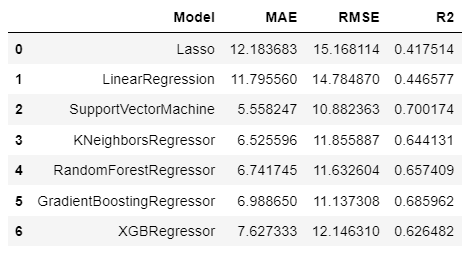

# Remaining Useful Life (RUL) Prediction for Turbofan Engines

### Objective

The objective of this project is to develop a machine learning model to predict the remaining useful life of aircraft turbofan engines. The Remaining Useful Life (RUL) is the amount of cycles an engine has left before it needs maintenance.


### AWS Deployment Link:

AWS deployment link: http://predictive-env-1.eba-5bwnxpqm.ap-south-1.elasticbeanstalk.com/


### Project Description :

In industry, prognostics and health management are key topics for anticipating asset state and avoiding downtime and breakdowns. Run-to-Failure simulation data from turbofan jet engines is included.

The C-MAPSS software was used to simulate engine degradation. Four separate sets of operational conditions and fault modes were simulated in four different ways. To characterize fault progression, record numerous sensor channels. The Prognostics CoE at NASA Ames provided the data set.

#### Abstract

❏ NASA released dataset of 218 turbofan
engines in 2008. The data was recorded until
the point of breakdown.

❏ In this project, we would try to understand
the data-set, and predict Remaining Useful
Life (RUL) of engines from testing data.

❏ We would try to deploy several machine
learning models on this data-set, and discuss
their performance. And finally, we would try
to solve this problem using a mix-match of
various algorithms to the best of our knowledge

### Data Set Organization

Data Set: FD001 Train trjectories: 100 Test trajectories: 100 Conditions: ONE (Sea Level) Fault Modes: ONE (HPC Degradation)

Data Set: FD002 Train trjectories: 260 Test trajectories: 259 Conditions: SIX Fault Modes: ONE (HPC Degradation)

Data Set: FD003 Train trjectories: 100 Test trajectories: 100 Conditions: ONE (Sea Level) Fault Modes: TWO (HPC Degradation, Fan Degradation)

Data Set: FD004 Train trjectories: 248 Test trajectories: 249 Conditions: SIX Fault Modes: TWO (HPC Degradation, Fan Degradation)

There are 4 dataset . In this repo I work on only First dataset


### EDA

❏ Train1 shape: (20631, 26)

❏ Test1 shape: (13096, 26)

❏ Rul1 shape: (100, 1)

❏ Train1 have data from 100 engine.

❏ Training data had following features:

    ❏ Unit number of engine

    ❏ nth cycle in operation

    ❏ 3 operational settings

    ❏ 21 sensor’s readings

    ❏ Each unit number was associated with a specific engine


operational settings does not empact to predict Rul of engine and Few sensor have constant data.


### Visualization:


Corelation Heatmap


After Dropping Constant Column


### RESUTS:




### INSTALLATION STEPS:

```
conda create -p venv python==3.9 -y
```

```
conda activate venv/
```

```
pip install -r requirements.txt
```

### Deployment:

```
python application.py
```

This is a Group Project. If anybody have any query , contact on below mails

ayushgandhi904@gmail.com

miqbal303@gmail.com

roma.chauhan@gmail.com

varshamahato1999@gmail.com


### Thanks
